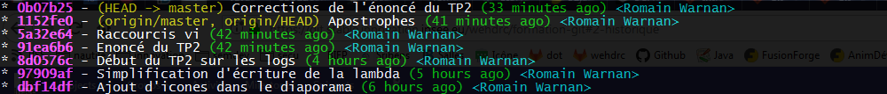
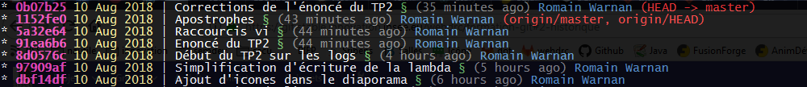
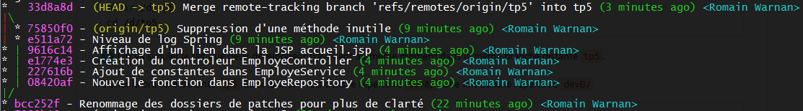
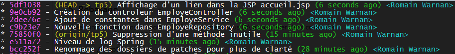
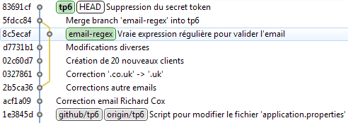
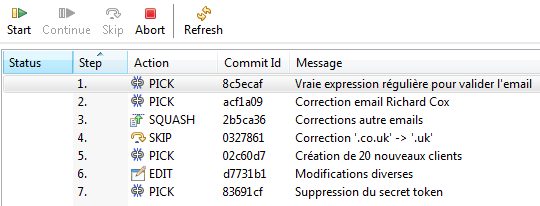
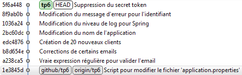

# Introduction à l’utilisation de Git à l’Insee

:arrow_forward: Diaporama [Gitlab](http://wehdrc.pages.innovation.insee.eu/formation-git) | [Github](https://romain-warnan.github.io/formation-git)

:bookmark_tabs: Imprimer [Gitlab](http://wehdrc.pages.innovation.insee.eu/formation-git/?print-pdf#/) | [Github](https://romain-warnan.github.io/formation-git/?print-pdf#/) (avec Chrome)

## Plan

 1. Présentation générale de Git
 2. Fonctionnement de Git
 3. Configuration et personnalisation
 4. Opérations de base &rarr; *TP1*
 5. Dépôts distants &rarr; *TP2*
 6. Historique des validations &rarr; *TP3*
 7. Branches
 8. Fusion
 9. Branches distantes &rarr; *TP4*
 10. Rebasage &rarr; *TP5*
 11. Réécriture de l’historique &rarr; *TP6*
 12. Outils Git
 13. Git côté serveur &rarr; *TP7*

## Travaux pratiques

### 1. Configuration et fondamentaux

#### Configuration

Paramétrer son nom et son email :
```bash
git config --global user.name "Prénom Nom"
git config --global user.email "prenom.nom@insee.fr"
```

Paramétrer le proxy Insee
```bash
git config --global http.proxy http://proxy-rie.http.insee.fr:8080
git config --global https.proxy http://proxy-rie.http.insee.fr:8080
```

Choisir son éditeur de texte favori
```bash
# notepad++
git config --global core.editor "'C:/Program Files/Notepad++/notepad++.exe' -multiInst -nosession"

# vim
git config --global core.editor vim
```

Afficher l’ancêtre commun lors d’un conflit
```bash
git config --global merge.conflictstyle diff3
```

Ne pas modifier les retours à la ligne
```bash
git config --global core.autocrlf false
git config --global core.safecrlf false
```

<details>
	<summary>Quelle est la valeur de la propriété <code>help.format</code> ?</summary>
	<code>git config help.format</code>
</details>
<br />
<details>
	<summary>Dans quel fichier cette propriété est-elle enregistrée ?</summary>
	<code>git config --list --show-origin | grep "help.format"</code>
</details>
<br />
<details>
	<summary>Combien y-a-til de propriétés système dans ce fichier ?</summary>
	<code>cat /c/ProgramData/Git/config | wc -l</code>
</details>

#### Opérations de base

Ajouter un alias vers Maven :

```bash
# Éditer le fichier .bashrc
vim ~/.bashrc

# Ajouter la ligne suivante et quitter vim
alias mvn='"/c/Program Files (x86)/insee/atelier-dev-2/applications/maven/bin/mvn.bat"'

# Recharger le fichier .bashrc
source ~/.bashrc
```

Créer un nouveau projet Maven :
```bash
cd /d
mvn -B archetype:generate -DgroupId=fr.insee.git -DartifactId=git-base
```

Initialiser un dépôt Git et constater la création du dépôt Git local :
```bash
cd git-base
git init
ls -al
```

Ajouter tous les fichiers dans l’index et valider dans un premier _commit_.
```bash
git add .
git status
git commit -m "Initialisation du projet 'git-base'"
```

Packager l’application, l’exécuter puis inspecter la copie de travail :
```bash
mvn package
java -cp target/git-base-1.0-SNAPSHOT.jar fr.insee.git.App
git status
```

Créer le fichier `.gitignore` pour exclure le répertoire `target/` et l’indexer :
```bash
vim .gitignore
git add .gitignore
git status
```

Constater que le répertoire `target/` n’est plus pris en compte : il n’a pas été ajouté à l’index et ne sera donc pas dans le prochain _commit_.

Valider.

```bash
git commit -m "Exclusion du répertoire 'target/'"
```

Créer les dossiers `src/main/resources` et `src/test/resources`,  inspecter la copie de travail :
```bash
mkdir -p src/main/resources src/test/resources
git status
```

:warning: Git ne détecte aucun changement car les répertoires sont vides.

Pour que ces dossier vides soient quand même présents dans l’historique, utiliser la technique suivante qui consiste à créer dans le dossier un fichier caché vide et a le valider :

```bash
touch src/main/resources/.git-empty src/test/resources/.git-empty
git status
git add .
git commit -m "Création des répertoires 'src/main/resources/' et 'src/test/resources/'"
```

Créer un fichier <code>README.txt</code> contenant un court texte.</summary>

Modifier le programme `fr.insee.git.App.java` pour qu’il puisse prendre un paramètre :
 - si le paramètre est renseigné, le programme affiche `"Hello {param} !"`,
 - sinon le programme affiche `"Hello World !"`

Compiler puis exécuter le programme en passant en paramètre votre prénom :

```bash
mvn package
java -cp target/git-base-1.0-SNAPSHOT.jar fr.insee.git.App "Prénom"
```

Indexer le fichier `README.txt`.

<details>
	<summary>Afficher les modifications qui seront validées dans le prochain <i>commit</i> :</summary>
	<code>git diff --staged</code>
</details>
<br />
<details>
	<summary>Afficher les modifications de la copie de travail par rapport à l’index :</summary>
	<code>git diff</code>
</details>
<br />

Valider les deux modifications dans deux *commits* séparés :
```bash
git commit -m "Création d’un fichier README.txt"
git commit -am "Possibilité de passer un paramètre à la méthode 'main'"
```

Renommer le fichier `README.txt` en `README.md` puis examiner l’état de la copie de travail :
```bash
mv README.txt README.md
git status
git add .
git status
```

Réinitialiser la copie de travail dans l’état du dernier *commit*
```bash
git reset --hard
```

Puis renommer le fichier avec Git :
```bash
git mv README.txt README.md
git status
```

Le résultat est le même : Git parvient à repérer les fichiers par la somme de contrôle de leur contenu.

:warning: Si en plus, le contenu du fichier est modifié, cela ne fonctionne plus.

### 2. Dépôts distants

En haut à droite de l’interface de Giltab, vérifier que vous ête bien connecté à Gitlab.

En haut de cette page, cliquer sur bouton « [Fork](https://git.stable.innovation.insee.eu/wehdrc/formation-git/forks/new) », puis choisir votre espace personnel.

> :information_source: Vous venez de copier le dépôt de la formation dans votre espace personnel Gitlab. Cette opération s’appelle un _fork_.
>
> Vous avez les droits
>  - en lecture et en écriture sur cette copie,
>  - en lecture seule sur le dépôt d’origine.

Clôner ce dépôt dans votre _workspace_ :
```bash
cd /d/*idep*/Mes\ Documents/eclipse_workspace
git clone [git@git.stable.innovation.insee.eu:22222]:*idep*/formation-git.git
cd formation-git
```

:warning: Pour tout problème SSH, appeler l’intervenant et se référer à cette [aide](https://git.stable.innovation.insee.eu/outils-transverses/migration-svn-git#-ajouter-une-clef-ssh-dans-gitlab).

Dans votre copie locale, effectuer la modification suivante :

<details>
	<summary>Dans le dossier <code>students/</code>, créer un fichier <code>*idep*.txt</code> contenant votre <code>*Prénom Nom*</code>.</summary>
	<code>echo '*Prénom Nom*' > students/*idep*.txt</code>
</details>

Indexer ce nouveau fichier, valider la modification et envoyer vers le serveur dépôt distant :
```bash
git add students/
git commit -m "Ajout d’un fichier idep.txt"
git push
```

Dans votre _fork_ du dépôt sur Gitlab, vérifier que votre fichier *idep*.txt est bien présent. Au contraire, vérifier qu’il est absent du [dépôt original](https://git.stable.innovation.insee.eu/wehdrc/formation-git/tree/master/students).

Ajouter un autre dépôt distant, nommé `upstream`, qui pointe vers le dépôt d’origine :
```bash
git remote add upstream [git@git.stable.innovation.insee.eu:22222]:wehdrc/formation-git.git
```

Mettre votre copie locale à jour à partir de ce nouveau dépôt :
```bash
git pull upstream master
```

Puis partager les éventuelles modifications dans votre dépôt :
 ```bash
git push origin
```

Dans votre _fork_ Gitlab, onglet « Branches », créer une nouvelle branche `tp2` à partir de master.
Puis cliquer sur le bouton « Create merge request » qui est apparu.
Finalement, cliquer sur « Submit merge request ».

:vertical_traffic_light: Attendre que l’intervevnant est accepté toutes les _merge requests_.

Mettre à jour votre copie locale à partir du dépôt d’origine :
```bash
git pull upstream master
```

Lister le répertoire `students/` et constater que vous avez récupérer les fichiers des autres élèves.
```bash
ls -l students/
```

Dans Gitlab, dans le [dépôt original](https://git.stable.innovation.insee.eu/wehdrc/formation-git/tree/master/students), constater la présence de votre fichier parmi celui des autres.

### 3. Historique

Afficher l’historique du dépôt formation-git :

```bash
git log
```

<details>
	<summary>Combien de <i>commits</i> datés d’avant le 31 juillet 2018 ce dépôt contient-il ?</summary>
	<code>518</code>
</details>
<br />
<details>
	<summary>Combien de <i>commits</i> datés d’avant le 31 juillet 2018 concernent les services ?</summary>
	<code>30</code>
</details>
<br />
<details>
	<summary>Dans quel <i>commits</i> a t-on mis en place un système de <i>logging</i> autre que <code>System.out</code> ?</summary>
	<code>df1c990</code>
</details>
<br />
<details>
	<summary>À quel heure de quel jour a été validé le premier test unitaire du projet ?</summary>
	<code>2016-09-01 16:53:26</code>
</details>
<br />

Afficher l’historique sous la forme suivante

```bash
* 8d0576c 2018-08-10 | Début du TP2 sur les logs (HEAD -> master) [Romain Warnan]
* 97909af 2018-08-10 | Simplification d’écriture de la lambda [Romain Warnan]
* dbf14df 2018-08-10 | Ajout d’icones dans le diaporama (origin/master, origin/HEAD) [Romain Warnan]
* 042c58b 2018-08-10 | Suppression de lignes en trop [Romain Warnan]
```

<details>
	<summary>Indice : <code>git log --graph --date=short --pretty="format:???"</code></summary>
	<code>git log --graph --date=short --pretty="format:%h %ad | %s%dq [%an]"</code>
</details>
<br />

<details>
	<summary>Modifier la commande précédente pour que le <i>hash</i> soit couleur cyan</summary>
	<code>git log --graph --date=short --pretty="format:%C(cyan)%h%Creset %ad | %s%dq [%an]"</code>
</details>
<br />

Créer les deux alias `git ll` et `git lg` qui permettent d’afficher un historique coloré :

```bash
git config --global alias.ll "log --graph --abbrev-commit --pretty=format:'%C(bold magenta)%h%Creset -%C(yellow)%d%Creset %s %Cgreen(%cr) %C(cyan)<%an>%Creset"
git config --global alias.lg 'log --graph --date=format:"%d %b %Y" --pretty="format:%C(bold #f442b6)%h%Creset %C(#fff291)%ad%Creset | %s %C(#66bc5e)§%Creset %C(#848484)(%ar)%Creset %C(#5493ce)%an%Creset%C(#f93131)%d%Creset"'
```

Tester ces affichages :

<details>
	<summary><code>git ll</code></summary>
	
</details>
<br />
<details>
	<summary><code>git lg</code></summary>
	
</details>
<br />

### 4. Branches

:wrench: Il est recommandé d’utiliser Eclipse pour faire ce TP. Toutes les commandes équivalentes aux actions réalisées dans Eclipse sont données dans l’énoncé.

#### Avance rapide

Dans une branche `salarie`, renommer toutes les variables "salarie" en "employe". Valider cette modification.

```bash
git checkout -b salarie
find src/main/java -type f -exec sed -i -e "s/salarie/employe/g" {} \;
find src/main/java -type f -exec unix2dos {} \;
git commit -am 'Renommage des variables salarie' -> 'employe'
```

Pour vérifier qu’il n’y a pas de régression, lancer les tests unitaires, puis lancer l’application [http://localhost:8080](http://localhost:8080) pour tester.

```bash
mvn test
mvn spring-boot:run
```

Fusionner la branche `salarie` dans `master`, consulter l’historique et supprimer la branche `salarie`.

```bash
git checkout master
git merge salarie
git lg
git branch -d salarie
```

#### Fusion à trois sources

Créer une branche `eol` dans laquelle il faut remplacer tous les retours à la ligne : `find src/main/java -type f -exec dos2unix {} \;`. Valider cette modification.

:information_source: On fait cette action pour simuler un de formatage de code différent entre deux développeurs. Ce cas peut se produire dans le cas où certains travaillent sous Linux et d’autres sous Windows.

```bash
git checkout -b eol
find src/main/java -type f -exec dos2unix {} \;
git commit -am "Remplacement des retours à la ligne"
```

Remplacer également le type de redirection par `TEMPORARY_REDIRECT` dans la classe `AccueilController`. Valider.

```bash
find src -type f -exec sed -i -e "s/MOVED_PERMANENTLY/TEMPORARY_REDIRECT/g" {} \;
git commit -am "redirection temporaire"
```

Dans la branche `master` renommer le *package* `model` en `beans`.

:information_source: Cette action représente un *refactoring* assez important.

```bash
git checkout master
find src -type f -exec sed -i -e "s/fr.insee.bar.model/fr.insee.bar.beans/g" {} \;
find src -type f -exec unix2dos {} \;
mv src/main/java/fr/insee/bar/model/ src/main/java/fr/insee/bar/beans
git add .
git commit -m "Renommer le package 'model' en 'beans'"
```

Fusionner la branche `eol` dans `master`. Constater la présence de nombreux conflits dus à la modification de chaque retours à la ligne. Annuler la fusion.

```bash
git merge eol
git status
git merge --abort
```

Relancer la fusion en ignorant les espaces : `git merge eol -Xignore-all-space`

Lancer les tests unitaires et supprimer la branche `eol`.

```bash
mvn test
git branch -d eol
```

Annuler le renommage du package.

```bash
git revert HEAD~1
```

#### Branches distantes

Créer et basculer sur une branche `tp4` qui suit la branche distante `origin/tp4`.

```bash
git checkout --track origin/tp4
```

Dans la copie locale, modifier le contenu du fichier `tp4.txt` en y ajoutant le texte `"Modification locale"`. Valider cette modification.

```bash
echo 'Modification locale' >> tp4.txt
git commit -am "Insertion d’une ligne dans tp4.txt"
```

Dans Gitlab, modifier le contenu du fichier `tp4.txt` en y ajoutant le texte `"Modification distante"`. Valider cette modification.

 - Mettre à jour sa copie locale à partir de la branche distante.
 - Constater la présence d’un conflit.
 - Le résoudre en gardant les modifications distante et locale (le fichier doit compter trois lignes).
 - Pousser vers la branche distante.

```bash
git fetch
git branch -vv # [origin/tp4: ahead 1, behind 1]
git merge
git diff
vi tp4.txt
git add tp4.txt
git commit -m "Résolution du conflit tp4.txt"
git push
```

### 5. Rebasage

Créer un nouveau dossier pour le TP5, directement sous D:\ et se placer dans ce dossier :

```bash
mkdir /d/tp5
cd /d/tp5
```

:information_source: On va simuler le fait que deux développeur travaillent au même moment dans la même branche distante `tp5`.

Cloner la branche distante `tp5` deux fois, une fois dans le répertoire `devA/`, une fois dans le répertoire `devB/`

```bash
git clone -b tp5 [git@git.stable.innovation.insee.eu:22222]:*idep*/formation-git.git devA
git clone -b tp5 [git@git.stable.innovation.insee.eu:22222]:*idep*/formation-git.git devB
```

Se placer dans le répertoire du développeur A, et appliquer les deux patches situés dans le répertoires `patches/devA/` :
```bash
cd /d/tp5/devA
git am --ignore-whitespace patches/devA/*.patch
```

Cela génère deux nouveaux *commits*, qui représentent le travail du développeur A, dans la copie de travail.

Pousser ces *commits* vers le dépôt distant :

```bash
git push
```

De même, dans le répertoire du développeur B, appliquer les quatre patches situés dans le répertoires `patches/devB/` :

```bash
cd /d/tp5/devB
git am --ignore-whitespace patches/devB/*.patch
```

Cela génère quatre nouveaux *commits*, qui représentent le travail du développeur B, dans la copie de travail.

:warning: Si on cherche à pousser les nouveaux *commits* vers le dépôt distant, Git refuse en nous informant que la copie locale n’est pas à jour.

```bash
git fetch origin
```

#### Fusion

Dans un premier temps, on va fusionner les modifications distantes dans la branche de travail et aboutir à un premier historique :
```bash
git merge origin/tp5
git log --oneline --graph
```

<details>
	<summary>Résultat avec fusion</summary>
	
</details>

On annule cette fusion en retournant un cran arrière :

```bash
git reset --hard HEAD~1
```

#### Rebasage

Cette fois-ci, on va rebaser notre travail (celui du développeur B) sur celui du développeur A.
```bash
git rebase origin/tp5
git log --oneline --graph
```

<details>
	<summary>Résultat avec rebasage</summary>
	
</details>

> :information_source: Les différences
>
> - __rebasage__ : historique linéaire, *hashs* modifiés ;
> - __fusion__ : historique non linéaire, existence d’un *commit* de fusion.

Pour finir, partager ces modifications et mettre à jour la copie du développeur A :
```bash
git push
cd ../devA
git pull
```

### 6. Réécrire l’historique

:tired_face: On se place dans la peau d’un développeur un peu fatigué qui commet donc des erreurs d’inattention.


#### Amender un *commit*

Remplacer l’image de la page d’accueil par le logo Git situé dans `docs/images/logo-git-png` :
 - créer une branche de suivi pour la branche tp6
 - copier le fichier `docs/images/logo-git-png` dans `src/main/webapp/static/`
 - dans `src/main/webapp/WEB-INF/views/accueil.jsp` remplacer `cocktail.png par` `logo-git.png`
 - lancer l’application et observer le résultat
 - valider la modification en utilisant la commande `git commit -am "Remplacement de l’image de la page d’accuiel"`

:warning: On vient de commettre deux erreurs :
  1. une faute de frappe sur le mot __accueil__ dans le message de validation
  2. le fichier __logo-git.png__ n’a pas été validé

Objectif : corriger ces erreurs en amendant le dernier *commit*.

On se rend compte ensuite que le fichier __cocktails.png__ n’est plus utilisé nul part.

Amender le dernier *commit* en supprimant ce fichier.

Pousser ces dernières modification vers le dépôt distant.

__Correction :__

```bash
# Création d’une branche de suivi tp6
git checkout --track origin/tp6

# Copie de l’image dans le bon répertoire
cp docs/images/logo-git.png src/main/webapp/static/

# Remplacement de l’adresse de l’image dans la jsp
sed -i "s/cocktails/logo-git/g" src/main/webapp/WEB-INF/views/accueil.jsp
unix2dos src/main/webapp/WEB-INF/views/accueil.jsp

# Lancement de l’application (terminer avec Ctrl + C)
mvn spring-boot:run

# Commit avec deux erreurs
git commit -am "Remplacement de l’image de la page d’accuiel"

# Indexation de la nouvelle image
git add src/main/webapp/static/logo-git.png

# Désindexation de l’ancienne image
git rm src/main/webapp/static/cocktails.png

# Amendemment du commit
git commit --amend -m "Remplacement de l’image de la page d’accueil"

# Envoi vers le serveur distant
git push
```

#### Rebasage interactif

Dans la branche `tp6`, effectuer les action suivantes :

:warning: __Valider à chaque étape sans jamais pousser vers le dépôt distant.__

 1. Modifier l’email de Richard Cox dans le fichier `clients.txt`
 2. Modifier quelques autres emails
 3.
  - créer une branch email-regex et basculer dessus
  - dans la classe `Client`, modifier l’expression régulière de l’email par [celle-ci](https://stackoverflow.com/a/742654/2110284)
  - retourner dans la branche `tp6`
 4. Remplacer l’extension d’email `co.uk` par `uk`
 5. Ajouter 20 nouvelles lignes dans le fichier &ndash; utiliser par exemple le site [mockaroo](https://www.mockaroo.com/)
 6.
  - modifier le titre de l’application : Spring MVC &rarr; Formation Git dans le fichier `application.properties`
  - modifier le niveau de log Spring : WARN &rarr; INFO dans le fichier `application.properties`
  - modifier un message dans le fichier dans le fichier `message_fr.properties`
 7. Fusionner la branche `email-regex`
 8. Supprimer la ligne « secret token » dans `application.properties`

Finalement l’historique ressemble à celui-ci :



Lancer un rebasage interactif sur ces *commits* dans Eclipse. Pour ce faire, il faut se rendre dans l’onglet « History » et faire un clic droit sur le *commit* précédent, c’est-à-dire « Script pour modifier le fichier 'application.properties'».

Dans l’onglet « Rebase Interactive », modifier le programme de rebasage pour qu’il fasse les actions suivantes :
 - placer en premier le *commit* de l’expression régulière de validation de l’adresse mail ;
 - fusionner les *commits* de modifications d’email en un seul ;
 - ignorer le *commit* concernant l’extension d’email `co.uk` &rarr; `uk` ;
 - conserver tels quels les *commits* d’ajout des 20 lignes et se suppression du *secret token* ;
 - éditer le *commit* concernant les fichiers de propriétés `message_fr.properties` et `application.properties`.

Le programme doit ressembler à celui-ci :



Lancer le rebasage en cliquant sur la flêche verte.

Modifier éventuellement les messages de *commit* quand cela est proposé.

Le rebasage s’arrête à l’édition du *commit*. L’objectif est de diviser le *commit* en trois *commits* :
 1. la modification du nom de l’application
 2. la modification du niveau de log
 3. la modification du message

Il faut repasser par la ligne de commande :

Défaire le *commit* en utilisant la commande suivante : `git reset HEAD^`.

 1. utiliser ensuite la commande `git add -p` pour indexer la première partie du fichier `application.properties` puis valider ;
 2. ensuite indexer le reste du fichier `application.properties` et valider ;
 3. finalement indexer et valider le reste.

Continuer le rebasage, qui se termine alors, aboutissant à un historique similaire à celui-ci :



> Pour lancer le rebasage dans la console, il suffit de taper `git rebase -i`
>
> Pour tout faire dans la console, il faut au moins connaitre les commandes vi suivantes :
>  - couper une ligne : `dd`
>  - coller une ligne au dessus : `P`

#### *Filter branch*

On se rend compte que la ligne *secret token* est présente depuis un moment dans l’historique alors que cette information devait rester secret et n’être donc pas validée et encore moins partagée dans le dépôt distant.

À la suite d’une inspection rapide, on constate aussi qu’un fichier `password.txt` a été validé et poussé vers le serveur.

Dans Gitlab, vérifier que l’historique de la branche distante `tp6` contient en effet ces informations sensibles.

On va faire disparaitre ces informations de l’historique.

**password.txt**

<details>
	<summary>Déterminer depuis quand le fichier <code>password.txt</code> est présent dans l’historique.</summary>
	<code>git log -- password.txt</code>
</details>
<br />

<details>
	<summary>Exécuter un <code>filter-branch</code> de type <code>index-filter</code> pour supprimer ce fichier de l’historique, depuis son apparition.</summary>
	<pre><code>git filter-branch -f --index-filter '
    git rm --cached --quiet --force "password.txt"
' --prune-empty -- b4b712e^..HEAD</code></pre>
</details>
<br />

**secret token**

<details>
	<summary>Déterminer depuis quand la ligne <code>application.secret.token=...</code> est présente dans l’historique.</summary>
	<code>git log -S"application.secret.token"</code>
</details>
<br />
<details>
	<summary>Exécuter un <code>filter-branch</code> de type <code>tree-filter</code> pour supprimer cette ligne de l’historique, depuis son apparition.</summary>
	<pre><code>git filter-branch -f --tree-filter '
    sed -i -E "/application\.secret\.token/d" src/main/resources/application.properties
' --prune-empty -- 092a022^..HEAD</code></pre>
</details>

Vérifier dans l’historique que les informations sensibles ont bien disparu.

```bash
# Extraire une ancienne version (detached HEAD)
git checkout HEAD~25

# Constater l’absence du fichier password.txt
ls -l

# Constater l’absence du secret token
cat src/main/resources/application.properties

# Revenir à la dernière version
git checkout tp6
```

Essayer de pousser vers le dépôt distant. Réessayer en utilisant `--force`. Dans Gitlab, vérifier que l’historique de la branche distante `tp6` ne contient plus les informations sensibles.

### 7. Boite à outils Git

## Liens utiles

 - [Git avec Eclipse](http://wehdrc.pages.innovation.insee.eu/git-au-quotidien/#/)
 - [Options rebasage](http://kamalmarhubi.com/blog/2016/03/08/git-rebase-exec-make-sure-your-tests-pass-at-each-commit-and-other-rebase-goodies/)
 - [Options de filter-branch](https://devsector.wordpress.com/2014/10/05/advanced-git-branch-filtering/comment-page-1/)
 - [Liste détaillée des hooks](https://www.digitalocean.com/community/tutorials/how-to-use-git-hooks-to-automate-development-and-deployment-tasks)